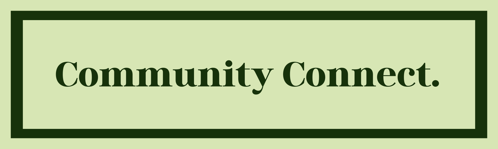
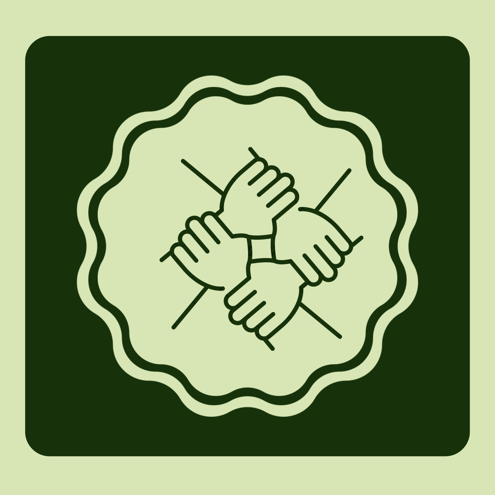

# 🌍 Community Connect

<p align="center">
  
</p>

<p align="center">
  
</p>

<h3 align="left">Connecting Communities Through Volunteering!</h3>


## 📌 About the Project

Community Connect is a mobile platform designed to connect volunteers with community service events.

Many people want to contribute to society but struggle to find volunteering opportunities. At the same time, organizations and community leaders often struggle to gather volunteers efficiently.

Community Connect bridges this gap by providing a platform where users can:

- Discover volunteering opportunities
- Participate in community service events
- Organize and manage events
- Encourage stronger community engagement

---

## 🎯 Problem Statement

Community service initiatives often face several challenges:

- Lack of volunteer awareness
- Difficulty organizing events
- No centralized platform for community service
- Poor communication between organizers and volunteers

Community Connect solves this problem by providing **a single platform where people can easily discover and organize volunteering events.**

---

## 🚀 Features

### 👤 User Authentication
- Secure signup and login
- User profile management

### 📅 Event Discovery
Users can:
- Browse community events
- View event details
- Register as volunteers

### 🏢 Event Creation
Organizers can:
- Create community events
- Add event description, time, and location
- Manage participants

### 🔔 Notifications
Users receive notifications about:
- Event registrations
- Event updates
- Participation confirmations

---

## 🧭 User Flow

### Volunteer Flow

1. User opens the app  
2. Signs up or logs in  
3. Browses community events  
4. Selects an event  
5. Registers as a volunteer  
6. Attends the event  

### Organizer Flow

1. Organizer logs in  
2. Creates a community event  
3. Publishes the event  
4. Volunteers register  
5. Organizer manages participants  

---

## 🛠 Tech Stack

### Frontend
Flutter (Mobile Application)

### Backend
Node.js  
Express.js  

### Database
MongoDB Atlas  

### Tools
GitHub  
VS Code  
REST APIs  

###Deployment
Render


---

## ⚙️ Installation Guide

### Clone the repository

```
git clone https://github.com/yourusername/community-connect.git
```

### Backend Setup

```
cd backend
npm install
npm start
```

### Flutter Setup

```
cd mobile
flutter pub get
flutter run
```

---

## 🔮 Future Enhancements

These features are planned for future development:

- QR Code event check-in
- Volunteer participation tracking
- Smart event recommendations
- Volunteer reward system
- NGO and organization integrations

---

## ⭐ Support

If you like this project, please give it a **⭐ star on GitHub.**
